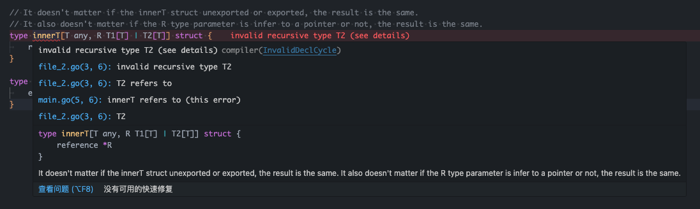

# Minimum reproduction of `invalid recursive type` error when defining one of the type parameter of type `innerT` with union type.



This is a bit tricky and unstable to reproduce by comparing to the [`minimum_repro/deadlock_issue`](../../deadlock_issue). Unlike the single file reproduction case in [`minimum_repro/unstable_invalid_recursive_issue/single_file`](../single_file) where the definition of type `innerT`, `T1` and `T2` are
within the same file and the compiler complained nothing but didn't generate the needed types and runtime assembly codes, the compiler would immediately complain about the `invalid recursive type` error when try to build.

## How to reproduce the issue?

1. You have to create a file that named `file_1.go` and containing the following definition:

```go
package seperated_files

// It doesn't matter if the innerT struct unexported or exported, the result is the same.
// It also doesn't matter if the R type parameter is infer to a pointer or not, the result is the same.
type innerT[T any, R T1[T] | T2[T]] struct {
    reference *R
}

type T1[T any] struct {
    e *innerT[T, T1[T]]
}
```

2. You have to create another file that named `file_2.go` and containing the following definition:

```go
package seperated_files

type T2[T any] struct {
    e *innerT[T, T2[T]]
}
```

3. You may not be able to get a red error from the compiler or IDE now. If you didn't, this means you failed to reproduce the issue, you have to try to rename `file_1.go` into other file name, and then see if the compiler or IDE will complain about the following error. However, you just need to keep rename the file if you didn't get any of the errors. Once you get the error, you can reload, reboot your editor / IDE, the error will remain and you can't get rid of it.

```txt
invalid recursive type innerT compilerInvalidDeclCycle

file_2.go(5, 6): innerT refers to
file_1.go(3, 6): T2 refers to
file_2.go(5, 6): innerT

invalid recursive type innerT (see details) compilerInvalidDeclCycle

file_2.go(5, 6): invalid recursive type innerT
file_2.go(5, 6): innerT refers to (this error)
file_1.go(3, 6): T2 refers to
file_2.go(5, 6): innerT

invalid recursive type innerT (see details) compilerInvalidDeclCycle

file_2.go(5, 6): invalid recursive type innerT
file_2.go(5, 6): innerT refers to
file_1.go(3, 6): T2 refers to
file_2.go(5, 6): innerT (this error)

type innerT[T any, R T1[T] | T2[T]] struct {
    reference *R
}
```

4. The issue is present if ask go compile to build. Run the following command to try to ask the compiler to build:

```shell
go build -v ./minimum_repro/unstable_invalid_recursive_issue/seperated_files
```

<details>
<summary>Output</summary>

```shell
go build -v ./minimum_repro/unstable_invalid_recursive_issue/seperated_files
github.com/nekomeowww/recursive_generic_type_issue_reproduction/minimum_repro/unstable_invalid_recursive_issue/seperated_files
# github.com/nekomeowww/recursive_generic_type_issue_reproduction/minimum_repro/unstable_invalid_recursive_issue/seperated_files
minimum_repro/unstable_invalid_recursive_issue/seperated_files/file_1.go:3:6: invalid recursive type T2
        minimum_repro/unstable_invalid_recursive_issue/seperated_files/file_1.go:3:6: T2 refers to
        minimum_repro/unstable_invalid_recursive_issue/seperated_files/file_2.go:5:6: innerT refers to
        minimum_repro/unstable_invalid_recursive_issue/seperated_files/file_1.go:3:6: T2
```

</details>
