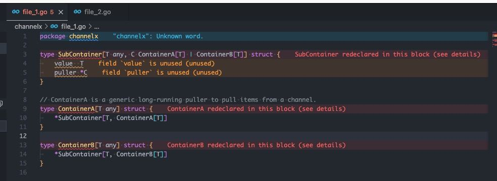

# Minimum reproduction of `redeclared` error when defining one of the type parameter of type `innerT` with union type.

This is the most hard to reproduced one by comparing to the other issues I have faced. I only encountered once when debugging the `invalid recursive type` error I faced in [`minimum_repro/unstable_invalid_recursive_issue/seperated_files`](../../unstable_invalid_recursive_issue/seperated_files).

## How to reproduce the issue?

1. I tried to rename and perform the fs event changes to `file_1.go` just the same as I described to reproduce the `invalid recursive type` error I faced in [`minimum_repro/unstable_invalid_recursive_issue/seperated_files`](../../unstable_invalid_recursive_issue/seperated_files).

2. Somehow after I reboot the editor / IDE, the `redeclared` error will appear in the editor / IDE and compiler.
